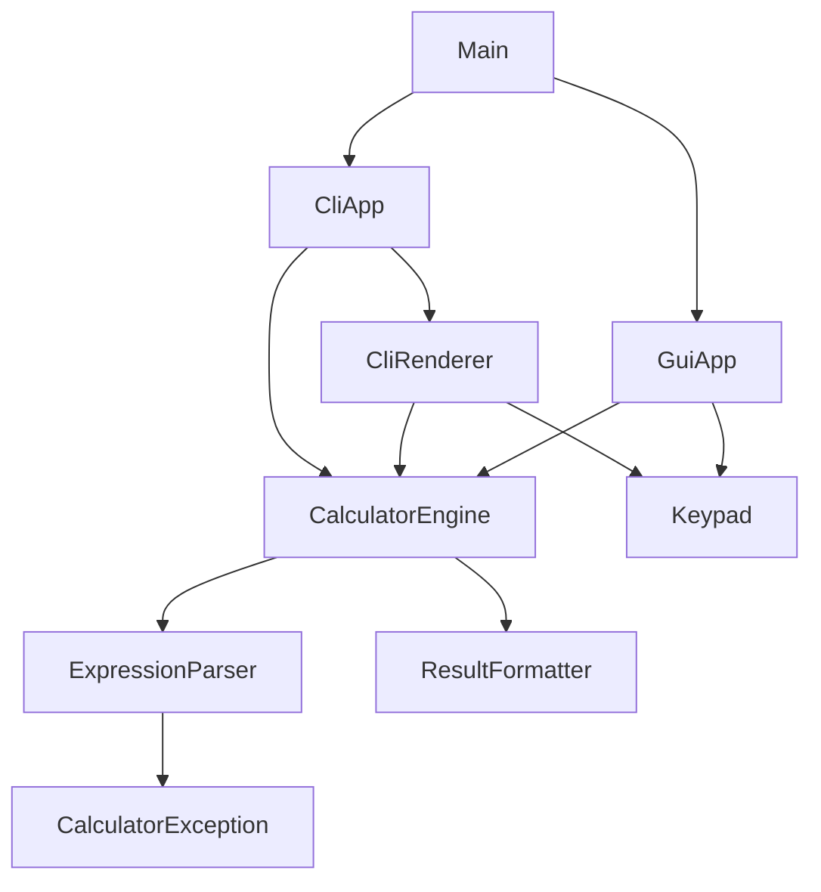

# 🧮 Kalkulator Canggih LuarNalar

[](https://github.com/aliefaqsha25/Kalkulator_Canggih_LuarNalar/actions/workflows/ci.yml)


Kalkulator yang ditulis dengan **Java 21** dan bisa dijalankan dalam **dua tampilan**: **CLI** (terminal, dengan papan tombol yang digambar rapi dan simetris) dan **GUI** (jendela Swing bertema gelap). Kedua tampilan memakai **satu mesin perhitungan yang sama**, sehingga perilakunya selalu konsisten.

Proyek ini dibuat sebagai tugas kelompok dengan struktur modular, tes unit, dan CI otomatis di GitHub Actions.

---

## 📑 Daftar Isi

- [Fitur](#-fitur)
- [Tampilan](#-tampilan)
- [Persyaratan](#-persyaratan)
- [Instalasi dan Menjalankan](#-instalasi-dan-menjalankan)
- [Cara Penggunaan](#-cara-penggunaan)
- [Contoh Perhitungan](#-contoh-perhitungan)
- [Arsitektur](#-arsitektur)
- [Pengujian](#-pengujian)
- [Pemecahan Masalah](#-pemecahan-masalah)
- [Anggota Kelompok](#-anggota-kelompok)
- [Pengembangan Lanjutan](#-pengembangan-lanjutan)
- [Lisensi](#-lisensi)

---

## ✨ Fitur

| Kategori | Fitur |
|---|---|
| **Operasi dasar** | Penjumlahan `+`, pengurangan `-`, perkalian `×`, pembagian `÷` |
| **Operasi lanjutan** | Persen `%`, akar kuadrat `√`, pangkat `^` |
| **Angka** | Digit `0`–`9`, bilangan desimal `.` |
| **Tanda & kurung** | Minus/positif `±`, kurung buka `(` dan tutup `)` |
| **Penyuntingan** | `DEL` (hapus satu karakter), `AC` (Clear All) |
| **Hasil** | Sama dengan `=` |

Selain itu:

- **Dua mode tampilan**, CLI dan GUI, dengan satu mesin hitung bersama.
- **Pratinjau hasil langsung** di GUI saat mengetik, tanpa menekan `=`.
- **Kurung otomatis ditutup** saat `=`. Contoh: `(2+3=` menghasilkan `5`.
- **Perkalian implisit**, misalnya `2(3+4)` sama dengan `2×(3+4)`.
- **Hasil bisa dilanjutkan**: setelah `=`, tekan operator untuk meneruskan perhitungan dari hasil tadi.
- **Pembulatan cerdas**: `0.1+0.2` menghasilkan `0.3`, bukan `0.30000000000000004`.
- **Penanganan error** yang aman (bagi nol, akar bilangan negatif, sintaks salah): program tidak berhenti, hanya menampilkan pesan.
- **Dukungan keyboard** penuh di GUI.
- **Operator ganda dirapikan otomatis** (`5+*3` menjadi `5×3`), begitu juga titik desimal ganda.

---

## 🖼 Tampilan

### Mode CLI

Papan tombol digambar dengan karakter kotak Unicode. Di bawah tiap tombol ada petunjuk tombol keyboard yang harus diketik.

```text
╭───────────────────────────────╮
│        KALKULATOR  CLI        │
├───────────────────────────────┤
│                            11 │
│                          = 11 │
├───────┬───────┬───────┬───────┤
│  AC   │  DEL  │   %   │   ÷   │
│   c   │   d   │   %   │   /   │
├───────┼───────┼───────┼───────┤
│   (   │   )   │   √   │   ^   │
│   (   │   )   │   r   │   ^   │
├───────┼───────┼───────┼───────┤
│   7   │   8   │   9   │   ×   │
│   7   │   8   │   9   │   *   │
├───────┼───────┼───────┼───────┤
│   4   │   5   │   6   │   -   │
│   4   │   5   │   6   │   -   │
├───────┼───────┼───────┼───────┤
│   1   │   2   │   3   │   +   │
│   1   │   2   │   3   │   +   │
├───────┼───────┼───────┼───────┤
│   ±   │   0   │   .   │   =   │
│   n   │   0   │   .   │   =   │
╰───────┴───────┴───────┴───────╯
  Ketik tombol lalu tekan Enter
       Contoh : 2+3*(4-1)=
 r=√  n=±  c=AC  d=DEL  q=keluar
```

Contoh di atas adalah tampilan setelah mengetik `2+3*(4-1)=`. Di terminal sungguhan, tombol `AC` dan `DEL` berwarna merah, operator kuning, dan `=` hijau.

### Mode GUI

Jendela Swing bertema gelap dengan tombol membulat, efek hover dan tekan, layar dua baris (ekspresi di atas, hasil besar di bawah), serta ukuran font hasil yang menyesuaikan panjang angka. Tombol `AC`/`DEL` berwarna merah, operator oranye, dan `=` hijau.


## 📋 Persyaratan

| Kebutuhan | Versi | Keterangan |
|---|---|---|
| **JDK** | **21** atau lebih baru | Wajib. Cek dengan `java -version` dan `javac -version`. |
| **Maven** | 3.6+ | Opsional, hanya untuk `mvn test` dan `mvn package`. |
| **Terminal** | Windows Terminal / PowerShell / bash | Disarankan, agar kotak dan warna tampil benar. |

Tidak ada dependensi eksternal saat program berjalan. JUnit 5 hanya dipakai untuk tes.

---

## 🚀 Instalasi dan Menjalankan

### 1. Unduh proyek

```bash
git clone https://github.com/aliefaqsha25/Kalkulator_Canggih_LuarNalar.git
cd Kalkulator_Canggih_LuarNalar
```

### 2. Jalankan

**Cara termudah: skrip bawaan** (otomatis kompilasi lalu menjalankan)

| Sistem | Perintah |
|---|---|
| **Windows** (CMD) | `run.bat` |
| **Windows** (PowerShell) | `.\run.bat` |
| **Linux / macOS** | `./run.sh` |

Tambahkan argumen untuk langsung memilih mode:

```bash
run.bat cli      # langsung mode CLI
run.bat gui      # langsung mode GUI
run.bat          # tampil menu: pilih 1 (CLI) atau 2 (GUI)
```

> Di Linux/macOS, jika muncul `Permission denied`, jalankan `chmod +x run.sh` terlebih dahulu.

**Manual (tanpa skrip)**

```bash
# Kompilasi
javac -encoding UTF-8 -d out $(find src/main/java -name '*.java')

# Jalankan
java -cp out com.kalkulator.Main          # menu pilih mode
java -cp out com.kalkulator.Main cli      # mode CLI
java -cp out com.kalkulator.Main gui      # mode GUI
```

Di Windows PowerShell, ganti baris kompilasi dengan:

```powershell
javac -encoding UTF-8 -d out (Get-ChildItem -Recurse src/main/java -Filter *.java).FullName
```

**Dengan Maven**

```bash
mvn test                                        # jalankan semua tes
mvn package                                     # buat target/kalkulator-java-1.0.0.jar
java -jar target/kalkulator-java-1.0.0.jar gui  # jalankan dari JAR
```

**Dari VS Code**

Jalankan lewat **terminal VS Code** (`` Ctrl+` ``): `run.bat gui` untuk GUI atau `run.bat cli` untuk CLI. Hindari tombol **Run** di atas `main`, karena Debug Console tidak bisa menerima input dengan benar untuk mode CLI.

---

## 🎮 Cara Penggunaan

### Mode CLI

Ketik tombol (boleh **berurutan dalam satu baris**), lalu tekan **Enter**. Layar diperbarui setiap kali Anda menekan Enter.

```text
▸ 2+3*(4-1)=          → hasil: 11
▸ r16=                → hasil: 4
▸ 5n+3=               → hasil: -2
▸ q                   → keluar
```

### Mode GUI

Klik tombol dengan mouse, **atau** ketik langsung dengan keyboard (jendela harus dalam keadaan aktif).

### Daftar tombol

| Fungsi | Tombol keyboard | Keterangan |
|---|---|---|
| Angka | `0` `1` `2` `3` `4` `5` `6` `7` `8` `9` | |
| Tambah | `+` | |
| Kurang | `-` | Juga bisa dipakai di awal ekspresi untuk bilangan negatif |
| Kali | `*` atau `x` | Tampil sebagai `×` |
| Bagi | `/` | Tampil sebagai `÷` |
| Persen | `%` | `x%` berarti x ÷ 100 |
| Desimal | `.` | Titik di awal otomatis jadi `0.` |
| Akar kuadrat | `r` | Tampil sebagai `√` |
| Pangkat | `^` | |
| Kurung buka / tutup | `(` `)` | Kurung tutup ditolak jika tidak ada pasangan buka |
| Minus / positif | `n` | Mengubah angka terakhir menjadi negatif `(-5)` atau kembali positif |
| Delete | `d` | GUI: `Backspace` |
| Clear All | `c` | GUI: `Esc` atau `Delete` |
| Sama dengan | `=` | GUI: `Enter` |
| Keluar | `q` | Hanya di CLI |

### Aturan perilaku

| Situasi | Perilaku |
|---|---|
| **Persen** | `x%` hanya membagi dengan 100. `50+10%` = `50.1`, dan `200×15%` = `30`. |
| **Akar** | `√` berlaku pada angka atau kurung tepat setelahnya. `√16^2` dihitung `(√16)^2` = `16`. |
| **Pangkat** | Bersifat *right-associative*: `2^3^2` = `2^(3^2)` = `512`. |
| **Minus di depan pangkat** | `-2^2` = `-4` (pangkat dihitung lebih dulu). |
| **Tombol `±`** | Hanya mengubah angka di ujung ekspresi: `5` jadi `(-5)`, dan `(-5)` kembali jadi `5`. |
| **Setelah `=`** | Mengetik **angka** memulai perhitungan baru. Mengetik **operator** melanjutkan dari hasil. |
| **Operator berurutan** | Operator terakhir menggantikan yang sebelumnya: `5+*3` menjadi `5×3`. |
| **Titik desimal ganda** | Diabaikan: `1.2.3` menjadi `1.23`. |
| **Kurung belum ditutup** | Ditutup otomatis saat `=`. |
| **Presisi** | Hasil dibulatkan ke **12 digit signifikan**; angka sangat besar atau kecil tampil dalam notasi ilmiah. |
| **Error** | Pesan merah, program tetap berjalan. Tekan `AC` untuk membersihkan layar. |

### Pesan error

| Pesan | Penyebab |
|---|---|
| `Error: dibagi nol` | Pembagian dengan nol, misalnya `8/0` |
| `Error: akar bilangan negatif` | Akar dari angka negatif, misalnya `√(0-4)` |
| `Error: tak terdefinisi` | Hasil tak hingga atau tidak terdefinisi, misalnya `9^999` |
| `Sintaks tidak valid` | Ekspresi belum lengkap, misalnya `3+` |
| `Kurung tidak seimbang` | Kurung tutup kurang atau tidak berpasangan |
| `Tombol 'z' tidak dikenal` | Karakter yang tidak ada di daftar tombol |

---

## 🧪 Contoh Perhitungan

Semua hasil di bawah diambil dari eksekusi program sebenarnya.

| Ketikan | Hasil |
|---|---|
| `2+3*(4-1)=` | `11` |
| `10/4=` | `2.5` |
| `2^10=` | `1024` |
| `2^3^2=` | `512` |
| `-2^2=` | `-4` |
| `r16=` | `4` |
| `r(9+16)=` | `5` |
| `r16^2=` | `16` |
| `200*15%=` | `30` |
| `50+10%=` | `50.1` |
| `5n+3=` | `-2` |
| `0.1+0.2=` | `0.3` |
| `1/3=` | `0.333333333333` |
| `2(3+4)=` | `14` |
| `(2+3=` | `5` (kurung otomatis ditutup) |
| `8/0=` | `Error: dibagi nol` |
| `r(0-4)=` | `Error: akar bilangan negatif` |

---

## 🏗 Arsitektur

### Struktur folder

```text
Kalkulator_Canggih_LuarNalar/
├── .github/workflows/ci.yml        # CI: jalankan tes otomatis di GitHub Actions
├── src/
│   ├── main/java/com/kalkulator/
│   │   ├── Main.java                   # titik masuk, memilih mode CLI/GUI
│   │   ├── core/                       # logika murni, tanpa UI
│   │   │   ├── CalculatorEngine.java   # state ekspresi + penanganan tombol
│   │   │   ├── ExpressionParser.java   # parser ekspresi (recursive descent)
│   │   │   ├── ResultFormatter.java    # pembulatan dan format hasil
│   │   │   └── CalculatorException.java
│   │   ├── ui/
│   │   │   └── Keypad.java             # tata letak tombol (dipakai CLI dan GUI)
│   │   ├── cli/
│   │   │   ├── CliApp.java             # loop interaktif + menu pilih mode
│   │   │   ├── CliRenderer.java        # menggambar kotak dan papan tombol
│   │   │   ├── ConsoleSetup.java       # setup UTF-8 konsol (Windows)
│   │   │   └── Ansi.java               # kode warna ANSI
│   │   └── gui/
│   │       ├── GuiApp.java             # jendela Swing
│   │       └── RoundButton.java        # tombol membulat
│   └── test/java/com/kalkulator/core/  # tes JUnit 5
├── pom.xml                         # konfigurasi Maven (Java 21)
├── run.bat / run.sh                # skrip kompilasi + jalan
├── .gitignore
├── LICENSE
└── README.md
```

### Ketergantungan antar modul



**Aturan utama:** paket `core` **tidak mengimpor apa pun** dari `cli`, `gui`, atau `ui`. Dengan begitu logika hitung bisa dites tanpa tampilan, dan tampilan baru (misalnya web) bisa ditambahkan tanpa menyentuh `core`.

### Peran tiap bagian

| Kelas | Tanggung jawab |
|---|---|
| `CalculatorEngine` | Menyimpan ekspresi yang sedang diketik, menerima penekanan tombol lewat `press(char)`, mengelola aturan (operator ganda, desimal, kurung, `±`, DEL, AC), dan memanggil parser saat `=`. |
| `ExpressionParser` | Mengubah teks ekspresi menjadi angka dengan parser *recursive descent*. |
| `ResultFormatter` | Membulatkan ke 12 digit signifikan dan membuang nol di belakang. |
| `Keypad` | Satu-satunya sumber data tata letak tombol (label, petunjuk, dan karakter yang dikirim) untuk CLI dan GUI. |
| `CliRenderer` | Menggambar kotak, layar, dan papan tombol sebagai teks. |
| `CliApp` | Loop baca input, kirim tiap karakter ke mesin, gambar ulang layar. |
| `GuiApp` / `RoundButton` | Jendela Swing, tombol, dukungan keyboard, dan pratinjau hasil. |

### Alur satu penekanan tombol

```text
Input (klik/ketik)  →  engine.press(tombol)  →  ekspresi diperbarui
                                              ↓ (jika "=")
                       ExpressionParser.evaluate(...)  →  ResultFormatter.format(...)
                                              ↓
                       tampilan membaca engine.getExpression() / getResult()
```

### Tata bahasa parser

Urutan prioritas operator, dari yang paling rendah ke tertinggi:

```text
expression := term    { ('+' | '-') term }
term       := unary   { ('×' | '÷' | '*' | '/' | implisit) unary }
unary      := ('-' | '+') unary | power
power      := postfix [ '^' unary ]            // right-associative
postfix    := primary { '%' }                  // x% = x / 100
primary    := angka | '(' expression ')' | '√' primary
```

| Prioritas | Operator |
|---|---|
| Tertinggi | `( )` dan angka |
| ↑ | `√` (berlaku pada `primary` sesudahnya) |
| ↑ | `%` (postfix) |
| ↑ | `^` (kanan ke kiri) |
| ↑ | `-` / `+` sebagai tanda (unary) |
| ↑ | `×` `÷` dan perkalian implisit |
| Terendah | `+` `-` |

---

## ✅ Pengujian

Proyek memiliki **30 metode tes** JUnit 5 pada paket `core`:

| Berkas tes | Jumlah | Yang diuji |
|---|---|---|
| `ExpressionParserTest` | 10 | Operasi dasar, pangkat bersifat kanan-ke-kiri, minus unary, akar, persen, perkalian implisit, desimal, dan semua jenis error |
| `ResultFormatterTest` | 3 | Pembuangan nol, pembulatan floating-point, notasi ilmiah |
| `CalculatorEngineTest` | 17 | DEL, AC, `±`, desimal, operator ganda, kurung otomatis, lanjut dari hasil, error, pratinjau, tombol tidak dikenal |

Jalankan dengan:

```bash
mvn test
```

Tes yang sama dijalankan otomatis oleh **GitHub Actions** (`.github/workflows/ci.yml`) pada setiap `push` dan *pull request*. Lencana **CI** di bagian atas README menunjukkan status terakhirnya.

---

## 🛠 Pemecahan Masalah

| Masalah | Penyebab dan solusi |
|---|---|
| Kotak tampil sebagai `Ôò¡ÔöÇ` | Konsol Windows memakai code page lama. Program sudah menjalankan `chcp 65001` otomatis. Jika masih rusak, gunakan **Windows Terminal** atau jalankan `chcp 65001` secara manual sebelum program. |
| Kotak tampil sebagai `?` atau bergeser | Font terminal tidak mendukung karakter kotak. Ganti ke **Consolas** atau **Cascadia Mono** (CMD: klik kanan judul → *Properties* → *Font*). |
| Warna tidak muncul / muncul kode aneh seperti `←[31m` | Terminal tidak mendukung ANSI. Pakai Windows Terminal atau PowerShell versi baru. |
| `'javac' is not recognized` | JDK belum terpasang atau belum masuk `PATH`. Pasang **JDK 21** (misalnya Temurin dari adoptium.net), lalu buka terminal baru. |
| `invalid target release: 21` atau `release version 21 not supported` | JDK yang aktif lebih lama dari 21. Cek `javac -version`, lalu pasang atau arahkan ke JDK 21. |
| Di VS Code JDK yang terpakai salah | `Ctrl+Shift+P` → **Java: Configure Java Runtime** → pilih JDK 21. |
| Mode CLI tidak bisa menerima input di VS Code | Jangan pakai tombol Run. Jalankan `run.bat cli` dari terminal VS Code. |
| GUI tidak muncul | Pastikan perangkat punya layar grafis. Di server, SSH, atau WSL tanpa tampilan, program mencetak pesan agar memakai mode CLI. |
| `Permission denied` saat `./run.sh` | Jalankan `chmod +x run.sh`. |
| Teks `√` `×` `÷` salah saat kompilasi manual | Selalu sertakan `-encoding UTF-8` pada `javac`. |

---

## 👥 Anggota Kelompok

| Nama | Bagian | File utama |
|---|---|---|
| **Alief Aqsha** | Konfigurasi proyek, GUI, dokumentasi | `pom.xml`, `run.bat`, `run.sh`, `ci.yml`, `GuiApp`, `RoundButton`, `README.md` |
| **Hanif Maulana** | Parser ekspresi dan formatter hasil | `ExpressionParser`, `ResultFormatter`, `CalculatorException`, tes parser dan formatter |
| **Ibnul Jawzy** | Mesin kalkulator dan tata letak tombol | `CalculatorEngine`, `Keypad`, tes engine |
| **M Ihsan Syahni** | Tampilan CLI dan titik masuk program | `CliApp`, `CliRenderer`, `ConsoleSetup`, `Ansi`, `Main` |

Setiap anggota memegang bagian yang terpisah dan memiliki jumlah commit yang sama, sehingga riwayat Git mencerminkan kontribusi masing-masing.

---

## 🔭 Pengembangan Lanjutan

Ide untuk versi berikutnya:

- [ ] Riwayat perhitungan (history)
- [ ] Fungsi memori `M+`, `M-`, `MR`, `MC`
- [ ] Fungsi ilmiah: `sin`, `cos`, `tan`, `log`, `ln`
- [ ] Pilihan tema terang/gelap pada GUI
- [ ] Tampilan berbasis web memanfaatkan `core` yang sudah terpisah

---

